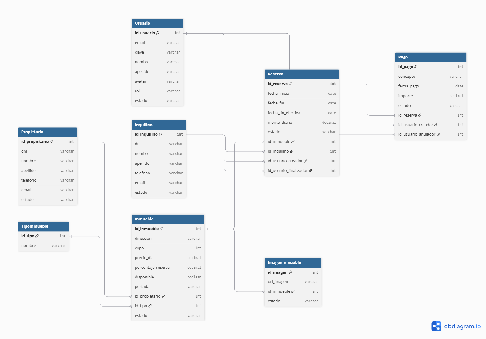

# Proyecto-Inmobiliaria
Sistema web para la gestión de alquileres temporarios de una agencia inmobiliaria. Incluye administración de inmuebles, propietarios, inquilinos, reservas, pagos y usuarios, con control de disponibilidad, renovaciones, cancelaciones con multas, etc.

---

## 👥 Integrantes del Grupo

* **Franco Javier Coria** - *[francojaviercoria2@gmail.com](mailto:francojaviercoria2@gmail.com)* - [@FrancoJCoria](https://github.com/FrancoJCoria) - Discord: `Franco Coria`
* **Emiliano Leguizamón** - *[emilegui76@gmail.com](mailto:emilegui76@gmail.com)* - [@Emi-legui](https://github.com/Emi-legui) - Discord: `Emi-legui`

---

## 📐 Modelado de Datos

El sistema se encuentra modelado mediante un **Diagrama Entidad-Relación (DER)**, representando las principales entidades, relaciones y reglas del negocio.

### Diagrama Entidad-Relación (DER)

> **Nota:** El diagrama se encuentra almacenado en la carpeta `/docs` del repositorio.
